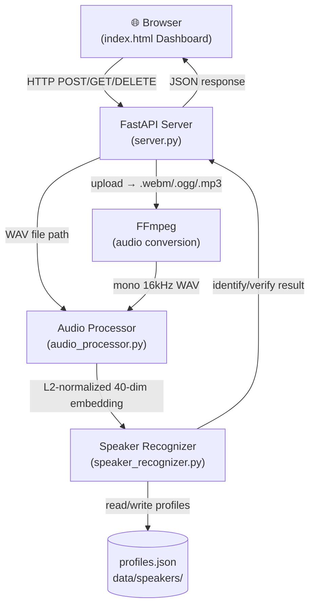

# Sound Sentinel — Project Documentation

## Table of Contents

1. [Project Overview](#1-project-overview)
2. [Architecture Diagram](#2-architecture-diagram)
3. [File Structure](#3-file-structure)
4. [Module Reference](#4-module-reference)
   - [audio_processor.py](#41-audio_processorpy)
   - [speaker_recognizer.py](#42-speaker_recognizerpy)
   - [server.py](#43-serverpy)
   - [main.py](#44-mainpy)
   - [index.html](#45-indexhtml)
5. [Audio Processing Pipeline](#5-audio-processing-pipeline)
6. [Machine Learning Approach](#6-machine-learning-approach)
7. [REST API Reference](#7-rest-api-reference)
8. [Frontend UI Guide](#8-frontend-ui-guide)
9. [Running the Application](#9-running-the-application)
10. [Design Decisions & Known Limitations](#10-design-decisions--known-limitations)

---

## 1. Project Overview

**Sound Sentinel** is a local voice biometrics system that can:

| Capability | Description |
|---|---|
| **Enroll** | Register a speaker's voice by uploading 1–5 audio samples |
| **Identify** | Determine *who* is speaking in an unknown audio clip |
| **Verify** | Confirm *whether* a specific person's voice matches a claim |

It is built entirely in Python (FastAPI backend) + plain HTML/JS (frontend dashboard), with no cloud dependencies — all processing runs locally.

**Tech Stack:**

| Layer | Technology |
|---|---|
| API Server | FastAPI + Uvicorn |
| Audio Analysis | librosa, NumPy |
| Speaker Engine | Custom MFCC + Cosine Similarity |
| Audio Conversion | FFmpeg (via subprocess) |
| Frontend | Vanilla HTML, CSS, JavaScript |
| Storage | JSON flat-file database |

---

## 2. Architecture Diagram



---

## 3. File Structure

```
sound-sentinel-main/
├── main.py                  # Entry point — starts uvicorn server
├── server.py                # FastAPI REST API + static HTML serving
├── speaker_recognizer.py    # Core recognition engine (enroll/identify/verify)
├── audio_processor.py       # Audio loading, preprocessing & MFCC extraction
├── diagnose.py              # Standalone diagnostic/debug tool
├── index.html               # Single-page dashboard UI
├── requirements.txt         # Python dependencies
├── data/
│   └── speakers/
│       └── profiles.json    # Persistent speaker database (auto-created)
└── venv/                    # Python virtual environment
```

---

## 4. Module Reference

### 4.1 `audio_processor.py`

Handles all audio I/O and feature extraction. Returns **40-dimensional L2-normalized embedding vectors** that represent a speaker's vocal characteristics.

#### Key Constants

| Constant | Value | Purpose |
|---|---|---|
| `SAMPLE_RATE` | 16,000 Hz | All audio resampled to this |
| `DURATION` | 4.0 sec | Fixed processing window |
| `N_MFCC` | 40 | Number of MFCC coefficients |
| `N_FFT` | 512 | FFT window size |
| `HOP_LENGTH` | 160 | ~10ms hop (standard ASR) |
| `PRE_EMPHASIS` | 0.97 | High-frequency boost |
| `TARGET_RMS` | 0.08 | Loudness normalization target |

#### Key Functions

| Function | Purpose |
|---|---|
| `loudness_normalize(audio)` | Scales audio to fixed RMS — removes volume differences between calm/angry speech |
| `apply_preemphasis(audio)` | Boosts high-frequency formants for better MFCC resolution |
| `voice_activity_detection(audio)` | Trims leading/trailing silence using librosa |
| `pad_or_truncate(audio, length)` | Center-crops if too long; tile-pads if too short |
| `extract_features(audio, sr)` | Computes weighted MFCC means → 40-dim vector |
| `aggregate_to_embedding(features)` | L2-normalizes the feature vector to unit sphere |
| `process_audio_file(path)` | Full pipeline for a file on disk → embedding |
| `process_audio_bytes(bytes)` | Full pipeline for raw bytes (browser upload/WebSocket) |

#### Feature Weighting Scheme

The system applies differential weighting to MFCC coefficients based on their emotional stability:

| Coefficients | Weight | Rationale |
|---|---|---|
| C1–C4 | **2.0×** | Vocal tract shape — speaker identity, emotion-independent |
| C5–C10 | **1.2×** | Mixed vocal tract + articulation |
| C11–C20 | **0.8×** | Fine spectral texture — slightly emotion-sensitive |
| C21–C40 | **0.4×** | Very fine detail — emotion-sensitive, down-weighted |

> [!NOTE]
> **Delta/delta² coefficients are intentionally excluded.** They capture how MFCCs change over time (prosody), which varies with emotion. Removing them is the single most important fix for cross-emotion speaker recognition.

---

### 4.2 `speaker_recognizer.py`

The core intelligence layer. Manages the speaker profile database and implements enrollment, identification, and verification.

#### Thresholds

| Parameter | Value | Meaning |
|---|---|---|
| `DEFAULT_THRESHOLD` | 0.70 | Minimum cosine similarity to accept a speaker match |
| `GAP_MARGIN` | 0.05 | Minimum score gap between #1 and #2 speakers (prevents ambiguous identification) |

#### Scoring Strategy

Scores are computed using a **fused approach**:

```
fused_score = 0.5 × centroid_score + 0.5 × best_sample_score
```

- **`centroid_score`**: Cosine similarity against the mean of all enrollment embeddings (normalized to unit sphere). Stable and smooths out outlier samples.
- **`best_sample_score`**: Best cosine similarity against any individual enrollment embedding. Catches cases where the query is very close to one specific recording.

#### Cosine Similarity Interpretation

| Score | Interpretation |
|---|---|
| ≥ 0.85 | Strong same-speaker match |
| 0.70–0.84 | Likely same speaker (above threshold) |
| 0.05–0.55 | Different speaker |
| < 0 | Definitely not this speaker (clamped to 0% in output) |

#### Methods

| Method | Description |
|---|---|
| `enroll(speaker_id, name, audio_paths)` | Registers a new speaker or adds samples to an existing profile. Computes centroid + stores individual embeddings. |
| `identify(audio_path)` | Scores audio against ALL enrolled speakers. Returns best match if above threshold AND gap ≥ 0.05. |
| `verify(claimed_speaker_id, audio_path)` | Scores audio against ONE specific speaker's profile. Returns verified/rejected + confidence. |
| `list_speakers()` | Returns all enrolled speaker IDs, names, and sample counts. |
| `delete_speaker(speaker_id)` | Permanently removes a speaker from the database. |
| `get_speaker(speaker_id)` | Returns metadata for a specific speaker. |

#### Database Format (`profiles.json`)

```json
{
  "user_001": {
    "name": "Alice",
    "n_samples": 3,
    "centroid": [0.123, -0.045, ...],   // 40-dim L2-normalized mean embedding
    "all_embeddings": [                  // Individual sample embeddings
      [0.118, -0.041, ...],
      [0.130, -0.050, ...],
      [0.121, -0.044, ...]
    ]
  }
}
```

---

### 4.3 `server.py`

FastAPI REST API server. Handles HTTP routing, file uploads, audio conversion via FFmpeg, and serves the HTML dashboard.

#### Audio Upload Flow

```
Browser upload (.webm/.ogg/.mp3/.wav)
    → save_upload_to_tmp()      — detect format, save to temp file
    → convert_to_wav()          — ffmpeg → mono 16kHz PCM WAV
    → SpeakerRecognizer method  — process + respond
    → cleanup temp files        — always runs in finally block
```

#### Cache-Control Headers

The root `/` endpoint serves `index.html` with:
```
Cache-Control: no-cache, no-store, must-revalidate
```
This ensures browser changes to `index.html` are always reflected immediately.

---

### 4.4 `main.py`

Simple entry point that:
1. Sets up the Python path to the project root
2. Creates the `data/speakers/` directory if it doesn't exist
3. Starts the Uvicorn server (non-reloading mode)

**Run with:**
```powershell
python main.py
# or with options:
python main.py --host 0.0.0.0 --port 8000 --log-level info
```

---

### 4.5 `index.html`

Single-file frontend dashboard. Includes all CSS and JavaScript inline. Communicates with the backend entirely via `fetch()` API calls to `/api/v1/...`.

**Views:**

| View | Route | Purpose |
|---|---|---|
| Dashboard | `/` | Shows all enrolled voice profiles in a card grid |
| Enroll Speaker | sidebar nav | Upload or record audio to register a new speaker |
| Identify Target | sidebar nav | Upload or record audio to identify an unknown speaker |
| Verify Claim | sidebar nav | Select an enrolled profile and check if audio matches |

**Live Recording:** Uses the `MediaRecorder` API + Web Audio `AnalyserNode` to record 3-second audio clips directly in the browser with a real-time waveform visualizer.

---

## 5. Audio Processing Pipeline

Every audio sample (whether uploaded or recorded) goes through this exact pipeline before any comparison:

```
Raw Audio
    │
    ├─ [1] Loudness Normalization    → RMS normalized to 0.08
    ├─ [2] Pre-emphasis Filter       → coef=0.97, boosts formants
    ├─ [3] Voice Activity Detection  → trim silence (top_db=25)
    ├─ [4] Pad / Truncate            → fixed 4-second window (64,000 samples)
    │
    ├─ [5] MFCC Extraction           → 41 coefficients (C0–C40)
    │       Drop C0 (energy)         → 40 coefficients (C1–C40)
    │       Mean-pool across time    → (40,) vector
    │
    ├─ [6] Feature Weighting         → vocal-tract dims × 2.0, fine detail × 0.4
    │
    └─ [7] L2 Normalization          → unit vector on 40-dim sphere
```

**Output:** A 40-dimensional unit vector (embedding) on the L2 sphere. Cosine similarity between two such vectors equals their dot product.

---

## 6. Machine Learning Approach

Sound Sentinel uses **classical signal processing** (not deep learning):

| Aspect | Detail |
|---|---|
| Feature type | MFCC (Mel-Frequency Cepstral Coefficients) |
| Similarity metric | Cosine similarity on L2-normalized vectors |
| Model storage | No ML model file — just JSON embeddings |
| Training required | No — works on first enrollment |
| Minimum samples | 1 (3–5 recommended for accuracy) |

### Why No Whitening?

Whitening (z-score normalization) requires a stable global distribution across many speakers. With only 1–5 speakers it is numerically unstable — the global std is dominated by within-speaker variance, causing even the same speaker's own recordings to score below threshold. **This project uses L2 normalization instead.**

### Why No Delta Features?

Delta and delta² coefficients capture the *rate of change* of MFCCs over time — effectively measuring prosody (speech rhythm, stress patterns). These change significantly with emotion (angry vs. calm speech). Removing them improves cross-emotion recognition at the cost of some temporal information.

---

## 7. REST API Reference

Base URL: `http://localhost:8000/api/v1`

Interactive docs available at: `http://localhost:8000/docs`

### Endpoints

#### `GET /health`
Returns API status and enrolled speaker count.

```json
{ "status": "ok", "speakers_enrolled": 3, "version": "1.0.0" }
```

---

#### `GET /speakers`
List all enrolled speakers.

```json
[
  { "speaker_id": "user_001", "name": "Alice", "n_samples": 3 },
  { "speaker_id": "user_002", "name": "Bob",   "n_samples": 5 }
]
```

---

#### `GET /speakers/{speaker_id}`
Get metadata for a specific speaker. Returns `404` if not found.

---

#### `POST /speakers/enroll`
Enroll a new speaker or add samples to an existing one.

**Form fields:**
| Field | Type | Description |
|---|---|---|
| `speaker_id` | string | Unique ID (e.g. `user_001`) |
| `speaker_name` | string | Display name (e.g. `Alice`) |
| `files` | file[] | 1–5 audio files (WAV/MP3/FLAC/WebM/OGG) |

**Response:**
```json
{
  "success": true,
  "speaker_id": "user_001",
  "name": "Alice",
  "n_samples": 3,
  "message": "Enrolled Alice with 3 new sample(s)."
}
```

---

#### `POST /speakers/identify`
Identify who is speaking in an unknown audio clip.

**Form fields:** `file` (audio file)

**Response:**
```json
{
  "identified": true,
  "speaker_id": "user_001",
  "speaker_name": "Alice",
  "confidence": 0.8734,
  "all_scores": { "user_001": 0.8734, "user_002": 0.3210 }
}
```

> [!IMPORTANT]
> Identification requires **both** `confidence ≥ 0.70` AND a score **gap ≥ 0.05** between the top two candidates. This prevents ambiguous matches when two speakers sound similar.

---

#### `POST /speakers/verify`
Verify whether audio matches a specific claimed speaker.

**Form fields:** `speaker_id` (string), `file` (audio file)

**Response:**
```json
{
  "verified": true,
  "speaker_id": "user_001",
  "speaker_name": "Alice",
  "confidence": 0.8921,
  "message": null
}
```

---

#### `DELETE /speakers/{speaker_id}`
Permanently delete a speaker profile. Returns `404` if not found.

---

## 8. Frontend UI Guide

### Dashboard
- Lists all enrolled voice profiles as cards
- Each card shows: display name, speaker ID, sample count, and a **Revoke** button
- Click **Refresh Profiles** to reload from the server

### Enroll Speaker
1. Enter a unique **Speaker ID** and **Display Name**
2. Upload audio files (WAV/MP3/OGG) — 3–5 recommended
3. **Or** click **Record Sample (3s)** to capture live audio (browser microphone)
4. Click **Register Profile** — you'll be redirected to the dashboard on success

### Identify Target
1. Upload an audio file or record a 3-second clip
2. Click **Run Identification Analysis**
3. Results panel shows:
   - Badge: `MATCH FOUND` or `NO MATCH`
   - Speaker name and ID (if matched)
   - Primary match confidence bar
   - All candidate scores with individual progress bars

### Verify Claim
1. Select an enrolled profile from the dropdown
2. Upload audio or record a clip
3. Click **Run Verification Protocol**
4. Results panel shows: `VERIFIED` / `REJECTED` badge + similarity score

### API Logs
Click **View API Logs** (top right) to open a sliding drawer showing all API call timestamps and raw JSON responses.

---

## 9. Running the Application

### Prerequisites

- Python 3.10+
- FFmpeg installed and available in PATH
- Dependencies installed:

```powershell
# From the project root
pip install -r requirements.txt
```

### Starting the Server

```powershell
# From sound-sentinel-main directory
python main.py
```

Server starts at: `http://localhost:8000`

Dashboard: `http://localhost:8000/`
Swagger UI: `http://localhost:8000/docs`

### Stopping the Server

Press `Ctrl+C` in the terminal. The `asyncio.CancelledError` / `KeyboardInterrupt` traceback that appears is **normal** — uvicorn's clean shutdown behavior.

---

## 10. Design Decisions & Known Limitations

### Design Decisions

| Decision | Rationale |
|---|---|
| **No deep learning** | Enables CPU-only operation, no GPU required, no model download |
| **L2-norm instead of whitening** | Whitening is numerically unstable with < 10 speakers |
| **FFmpeg for audio conversion** | Browser-recorded WebM/Opus is not natively readable by librosa |
| **Fused score (centroid + best-sample)** | More robust than either alone — centroid smooths outliers, best-sample handles close matches |
| **Flat JSON database** | Simple persistence, human-readable, no database server required |
| **No-cache headers on index.html** | Prevents browser caching stale dashboard after edits |

### Known Limitations

| Limitation | Impact |
|---|---|
| **Threshold tuned for quiet environments** | Background noise can lower similarity scores |
| **Short recordings (< 2s) reduce accuracy** | MFCC statistics are less stable with little speech data |
| **Similar voices may cause misidentification** | The 0.05 gap margin helps but isn't perfect |
| **No authentication** | The API is open; suitable for local/development use only |
| **Single-process, no concurrency** | One inference at a time; not suited for production scale |

### Phase Roadmap

| Phase | Status | Features |
|---|---|---|
| **Phase 1** (current) | ✅ Complete | File upload, REST API, Dashboard UI |
| **Phase 2** | 🔜 Planned | WebSocket real-time streaming endpoint |
| **Phase 3** | 🔜 Planned | Authentication, rate limiting, multi-tenant support |
